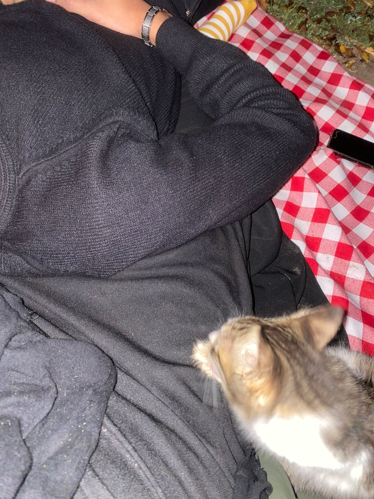
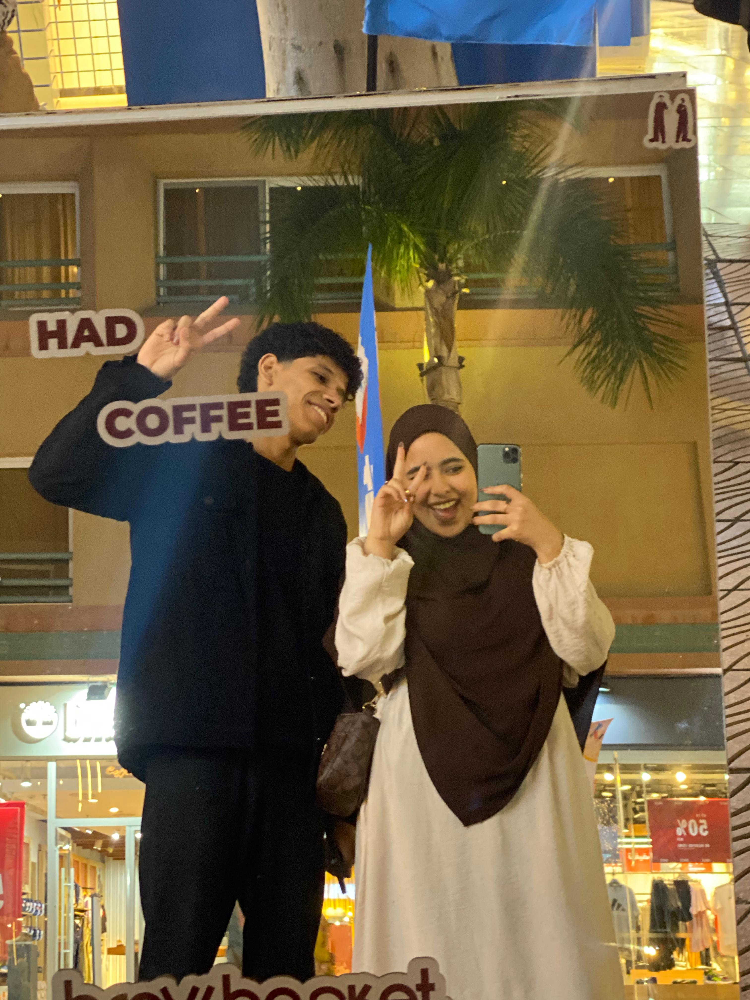

<!DOCTYPE html>
<html lang="ar" dir="rtl">
<head>
    <meta charset="UTF-8">
    <meta name="viewport" content="width=device-width, initial-scale=1.0">
    <title>Ömrüm</title>
    <!-- استدعاء خط رومانسي أنيق مشابه للخط في الصورة -->
    <link href="https://fonts.googleapis.com/css2?family=Great+Vibes&display=swap" rel="stylesheet">
    
</head>
<body>

    <!-- عناصر القلوب المفرغة الرومانسية -->
    

    

        
        <!-- الصفحة الأولى (صفحة كلمة السر) -->
        

            <h1>Ömrüm</h1>
            <h2>Happy birthday</h2>
            
            <!-- 8 خانات لإدخال 8 أرقام -->
            

                <input type="password" maxlength="1" class="otp-input" oninput="moveNext(this, 1)" onkeydown="moveBack(event, this, 1)">
                <input type="password" maxlength="1" class="otp-input" oninput="moveNext(this, 2)" onkeydown="moveBack(event, this, 2)">
                <input type="password" maxlength="1" class="otp-input" oninput="moveNext(this, 3)" onkeydown="moveBack(event, this, 3)">
                <input type="password" maxlength="1" class="otp-input" oninput="moveNext(this, 4)" onkeydown="moveBack(event, this, 4)">
                <input type="password" maxlength="1" class="otp-input" oninput="moveNext(this, 5)" onkeydown="moveBack(event, this, 5)">
                <input type="password" maxlength="1" class="otp-input" oninput="moveNext(this, 6)" onkeydown="moveBack(event, this, 6)">
                <input type="password" maxlength="1" class="otp-input" oninput="moveNext(this, 7)" onkeydown="moveBack(event, this, 7)">
                <input type="password" maxlength="1" class="otp-input" oninput="moveNext(this, 8)" onkeydown="moveBack(event, this, 8)">
            

            <button class="enter-btn" onclick="checkPassword()">Enter</button>
            
❌ كلمة السر غير صحيحة!

        

        <!-- الصفحة الثانية (المحتوى) -->
        

            
            

                🥖 <b>ملاحظة أولى:</b> كتبتك الكلام ده عشان أفتكرك دايماً إنك أجمل حاجة حصلت في حياتي.. بحبك أوي ❤️
            

            
Our Beautiful Memories

            

                

                

                

                

            

            
Special Video

            

                <video controls preload="metadata">
                    <source src="V1.MP4" type="video/mp4">
                </video>
            

            
The Best Song

            

                <audio controls preload="metadata">
                    <source src="S1.MP3" type="audio/mpeg">
                </audio>
            

            

                ❤️ <b>ملاحظة إضافية:</b> كل ما أسمع الأغنية دي بفكرك كل لحظة حلوة جمعتنا.. ربنا يديمك في حياتي يا رب 🥳
            

        

    

    

</body>
</html>
